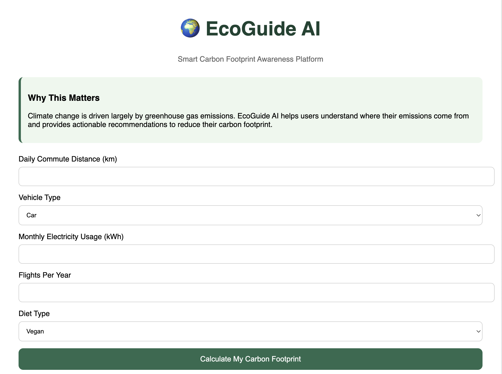
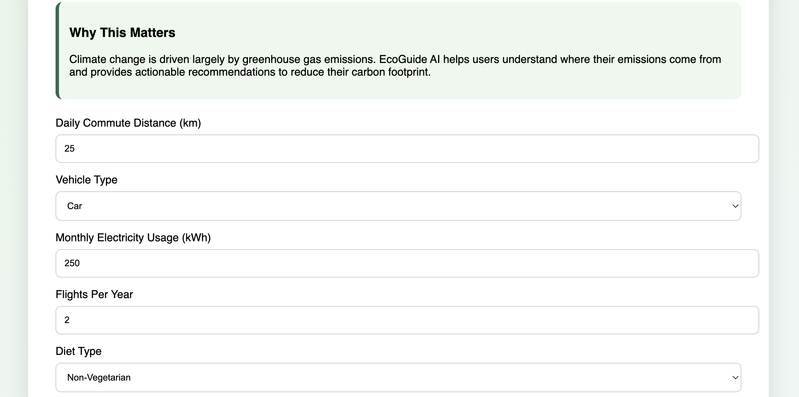
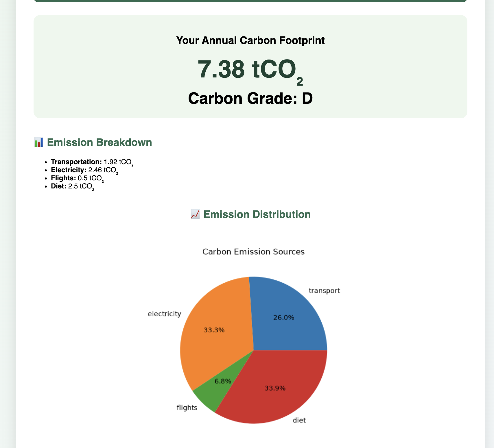
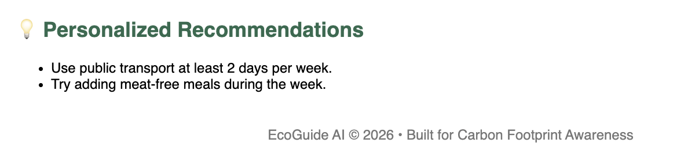

# EcoGuide AI

## Overview

EcoGuide AI is a Carbon Footprint Awareness Platform that helps users estimate their annual carbon emissions and receive personalized recommendations for reducing environmental impact.

## Features

- Carbon Footprint Calculator
- Carbon Grade (A–F)
- Emission Breakdown
- Emission Visualization
- Personalized Sustainability Recommendations
- Responsive User Interface

## Tech Stack

- Python
- Flask
- HTML
- CSS
- Chart Visualization
- Pytest

## How It Works

Users enter:

- Daily commute distance
- Vehicle type
- Monthly electricity usage
- Flights per year
- Diet type

The application calculates annual emissions and generates:

- Carbon score
- Carbon grade
- Emission breakdown
- Sustainability recommendations

## Deployment

Live Application:

https://eco-guide-ai-1.onrender.com/

## Repository

https://github.com/mikulmanothaar/eco-guide-ai

## Future Improvements

- User accounts
- Emission history tracking
- AI-powered sustainability suggestions
- Community sustainability leaderboard
## Application Screenshots

### Home Page

### Input Form

### Results Dashboard

### Personalized Recommendations

